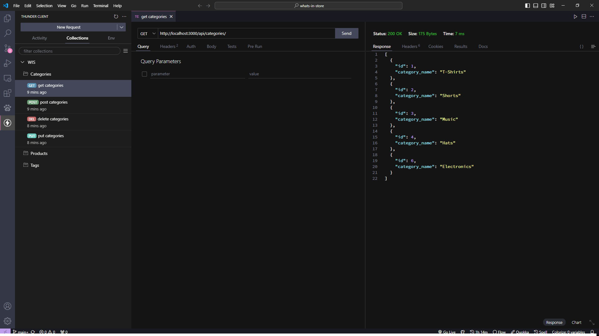
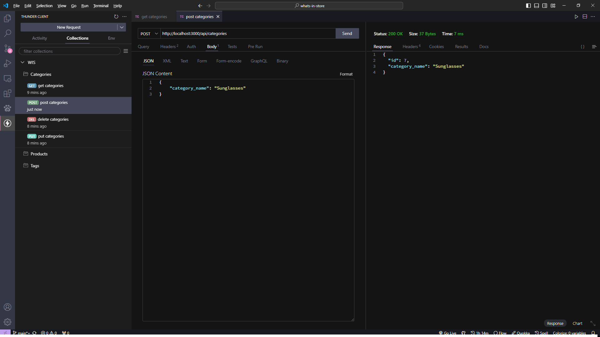
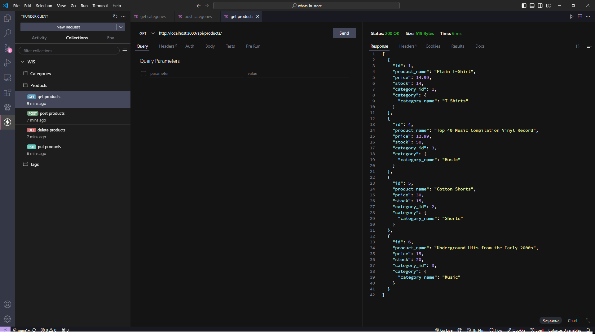
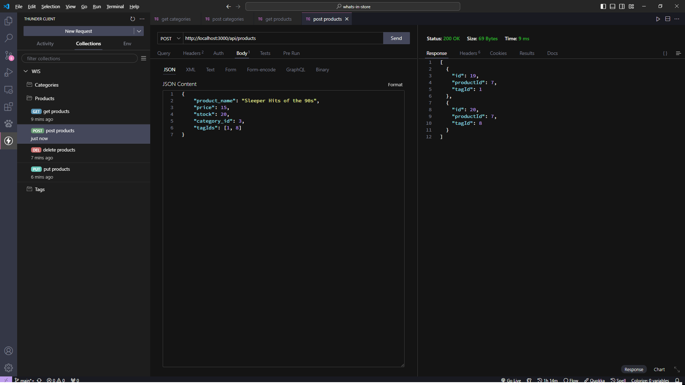
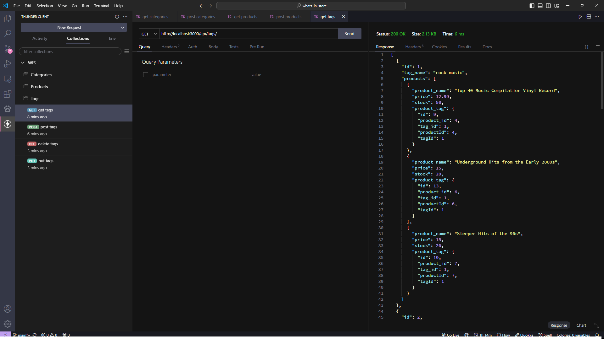
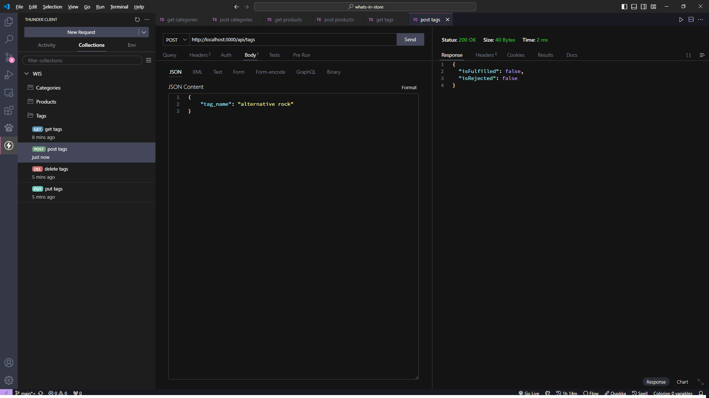

# What's In Store
What's In Store is a simple RESTful API that allows you to manage your inventory.
It uses a MySQL database on the backend for all your data storage needs.

## Installation
The installation for the app if simple:
- run `npm i` to install the necessary node packages.
- run `node seeds/index.js` to seed the database with filler data, or modify the seed data in the `seeds` folder with your data.
- run `npm start` to start the server.

## Tests
Below are some images of some endpoint tests for getting and inserting data into each section of the database:

### Categories Requests

### Products Requests

### Tags Requests

